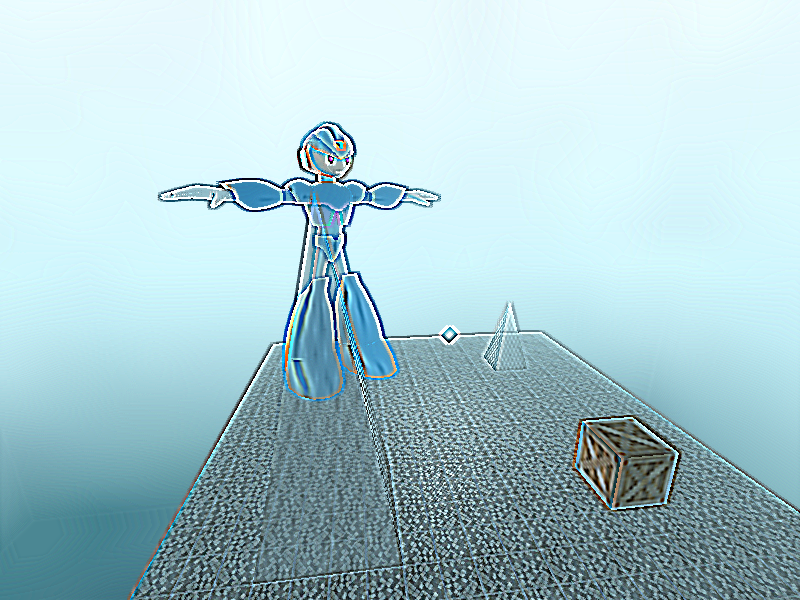
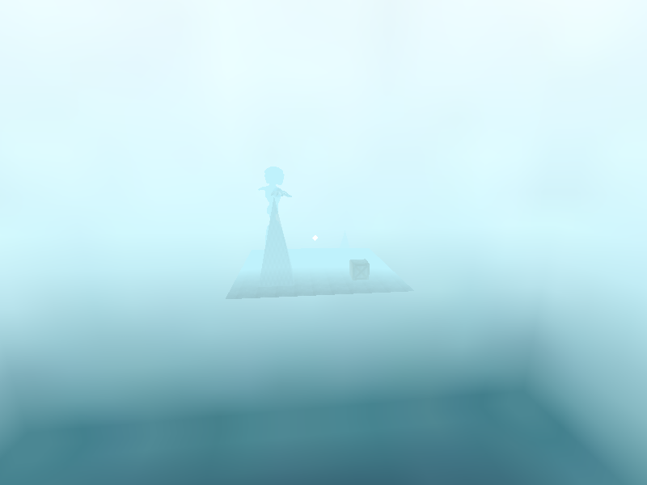
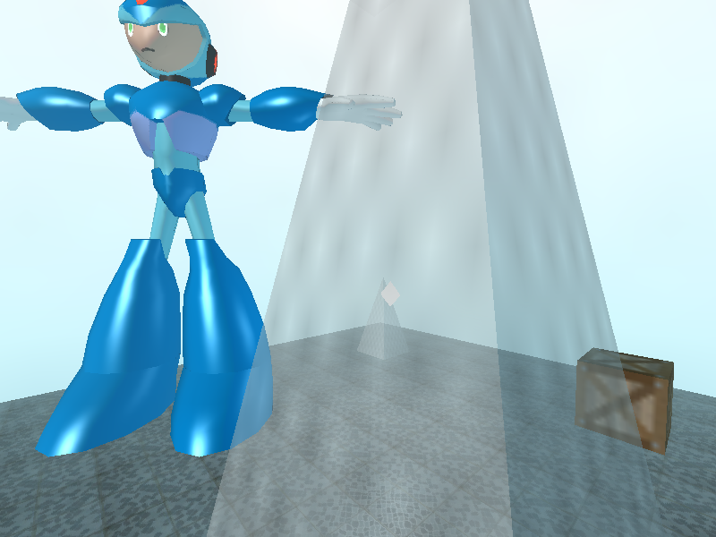
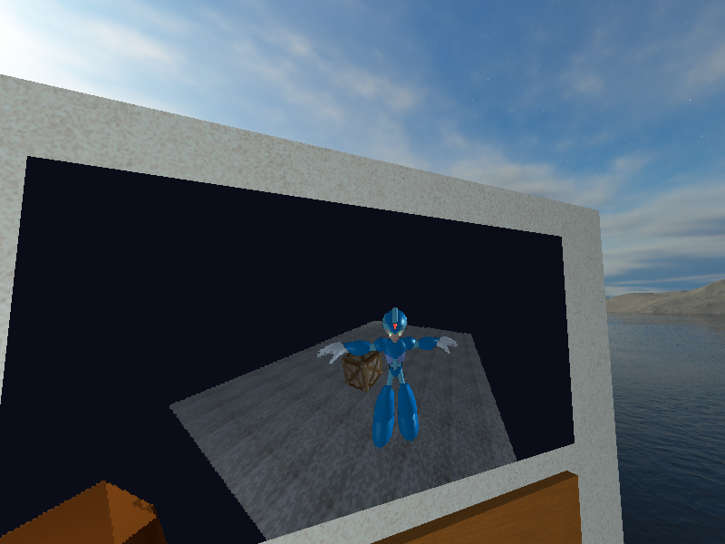

# OpenGL 3D Project

This is an OpenGL application that can load and display assets, transform 3D geometry and control a camera.

# Features
- 3D free camera
- Primitive 3D mesh creation
- .obj model loading
- Transform operations
- Rendering abstraction to make it easier to render 3D meshes
- Phong lighting model
- Diffuse, specular and emissive maps
- Material class that abstracts the process of loading and applying texture maps to meshes
- Transparency
- Skybox
- Linear fog
- Post-processing effects
- Framebuffer textures (not active in the current iteration of the application)
- Lots of abstractions
- Much more!

# Images
### Post-processing effect

### Linear fog

### Transparency

### Framebuffer texture

# How to run and compile
Open the project in Visual Studio 2019 and compile. The default settings should be enough to run this project.

#### Notes:
- If you try to run directly from the executable (after compiling) you will need to add the Assets folder (with the Textures folder in it) to the same directory as the executable.
- You may only compile in x86.
- If you're using a different version of Visual Studio, make sure to select the available Windows SDK and Toolset versions on project properties.
